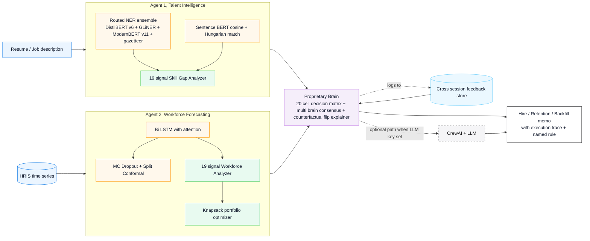

# Workforce Intelligence System

**Multi agent AI for energy industry workforce planning**

Solo Project, Jiri Musil. ITAI 2376 Deep Learning, Spring 2026. Houston City College, Professor Patricia McManus.

## What this agent does

The system reads resumes and job descriptions, reads twelve months of HRIS time series for a department, and produces one boardroom ready memo that combines a hire decision, a retention plan for the receiving team, and a backfill pipeline for the role. The memo cites specific numbers from verified deep learning model outputs, names the policy rule the verdict came from, and ships with a full execution trace so every recommendation traces back to a tool call.

The target user is a People Strategy Lead, an HR Business Partner, or a CHRO at a large energy company. The system was built around a real problem from CERAWeek 2026: 76 million energy jobs worldwide, 2.4 workers near retirement for every new hire under 25 in advanced economies, 40 percent of plant operators projected to retire by the end of this decade, and only 8 percent of energy organizations with real visibility into the skills their workforce already has.

## Option chosen

Option B, Multi Agent System. Two agents with distinct roles communicate through a single orchestrator.

* **Agent 1, Talent Intelligence.** Reads resumes and job descriptions, extracts named entities with a routed NER ensemble, computes semantic match with Sentence BERT, runs a 19 signal skill gap analyzer that names the specific missing skills and certifications.
* **Agent 2, Workforce Forecasting.** Reads HRIS time series, runs a Bidirectional LSTM with attention to predict attrition probability and headcount drift over 3, 6, and 12 month horizons, decomposes the prediction into 19 decision grade signals (driver attribution, cohort segmentation, intervention simulator, replacement cost, internal mobility bench, dual uncertainty intervals, scenario simulator), and produces an executive briefing.

## Framework note (deviation from the midterm blueprint)

The blueprint committed to CrewAI plus Claude Sonnet as the agent brain. The final system ships two interchangeable orchestrators that read the exact same tool layer and deep learning models:

1. A **proprietary deterministic brain** in `brain.py` (the default) that composes the same 21 tools into five end to end workflows, applies a 20 cell decision matrix where every verdict traces to a named rule, runs three independent decision procedures in parallel for a multi brain consensus check, and synthesizes templated boardroom memos. Zero external API dependency. Around 500 milliseconds per memo.

2. The **CrewAI plus LLM path** in `agents.py` (kept wired) for cases where open ended generation is preferred over traceability. Activates automatically when an LLM API key is set in `.env`.

I built both because workforce planning is a high stakes and audited domain. A 20 cell rule matrix can defend a do not advance recommendation in the language a labor relations attorney expects. An LLM brain produces fluent narratives that cannot. The CrewAI option remains available for tasks where free text generation is genuinely useful (resume coaching, draft job descriptions, multi turn interview prep dialogue).

## Architecture



## Deep learning models

| Model | Role | Course module |
| --- | --- | --- |
| DistilBERT cased, fine tuned | Resume NER, legacy 5 classes (SKILL, CERT, DEGREE, EMPLOYER, YEARS_EXP) | Module 05 Transformers |
| GLiNER zero shot (NAACL 2024) | Resume NER, 10 class generalist coverage | Module 05 Transformers |
| ModernBERT v11 | Resume NER, owns the TOOL class | Module 05 Transformers |
| Sentence BERT (all MiniLM L6 v2) | Semantic candidate to job match via cosine plus Hungarian | Module 05 Transformers |
| Bidirectional LSTM with attention | Department level attrition probability and headcount forecast | Module 03 RNN and LSTM |
| Routed per class ensemble | Per class hard ownership router across the four NER models above | Module 05 Transformers |
| Custom proprietary brain | Plan, Act, Observe, Respond loop over 21 tools, no LLM dependency | Module 10 Agentic AI |

The four NER models cooperate through a per class router. Each class is owned by the model that wins on real held out evaluation against the adjudicated dev set described in `docs/EVAL_METHODOLOGY.md`. This is not a single monolithic model dressed up as an ensemble; it is an explicit hard ownership decision per label class.

## Frameworks and tools

* **Agent runtime, primary**: custom orchestrator in `brain.py`, deterministic, zero LLM dependency.
* **Agent runtime, optional**: CrewAI 0.80+ plus LangChain 0.3+ plus an LLM provider key.
* **Deep learning**: PyTorch 2.0+, Hugging Face Transformers 4.35+, Sentence Transformers 2.2+, GLiNER 0.2+.
* **Data and matching**: NumPy, pandas, scikit learn, scipy (Hungarian assignment).
* **Dashboard**: Streamlit 1.28+, Plotly 5.18+.
* **Knowledge base**: O\*NET style skill mapping, BLS energy sector employment indices, internal HRIS schema.

## Repository structure

```
.
├── README.md                this file
├── REFLECTION.md            5 section reflection per the assignment rubric
├── requirements.txt         Python 3.11 dependencies
├── Dockerfile               container build for the agent
├── .env.example             template for the optional LLM key path
├── .gitignore
├── main.py                  entry point with 6 run modes
├── brain.py                 proprietary deterministic agent runtime (primary)
├── agents.py                CrewAI agent definitions (optional LLM path)
├── dashboard.py             Streamlit boardroom dashboard
├── feedback.py              Human in the loop feedback store and learning engine
├── config/                  hyperparameters and run configuration
├── data/
│   ├── sample_resumes.py    sample candidates and job descriptions for the demo
│   ├── generate_ner_data.py synthetic resume generators for training
│   ├── generate_workforce_data.py temporal HRIS data synthesizers
│   ├── employees.csv        sample workforce facts
│   ├── individual_monthly.csv per employee monthly time series
│   ├── monthly_department.csv per department monthly aggregates
│   └── processed/
│       ├── eval_dev_v1.json                                 masked dev set source
│       ├── eval_dev_v1_adjudicated.labels.json              canonical adjudicated labels (840 spans, 25 docs)
│       ├── eval_dev_v1_adjudication_provenance.jsonl        per span provenance with verification status
│       ├── eval_dev_v1_adjudicated.manifest.json            top level manifest with sha256 and integrity bracket
│       └── eval_results_*.json                              held out F1 receipts per model variant
├── docs/
│   ├── EVAL_METHODOLOGY.md  multi stage adjudication pipeline that produced the canonical labels
│   └── DEMO_SCRIPT.md       narration script for the recorded demo
├── industries/              industry profile plugins (energy, finance template)
├── models/
│   ├── ner_model.py         Routed NER ensemble (DistilBERT, GLiNER, ModernBERT, gazetteer)
│   ├── sbert_matcher.py     Sentence BERT semantic matcher
│   ├── bilstm_model.py      Bi LSTM forecasting engine
│   └── saved/               (gitignored, populated by first run training or download)
├── tools/
│   ├── talent_tools.py      6 CrewAI tools wrapping Agent 1's analyzers
│   └── forecast_tools.py    17 CrewAI tools wrapping Agent 2's analyzers
└── utils/
```

## Setup

### Option 1, Local Python

```bash
# requires Python 3.11
python3.11 -m venv venv
source venv/bin/activate

pip install --upgrade pip
pip install -r requirements.txt

cp .env.example .env
# .env is optional. With no key the system runs the proprietary brain end to end.
# Add OPENAI_API_KEY, ANTHROPIC_API_KEY, or GOOGLE_API_KEY to enable the CrewAI path.
```

On first run the system trains the three deep learning models from synthetic data shipped with the repo. Training takes about 5 to 10 minutes on a modern laptop CPU and 1 to 2 minutes on Apple Silicon MPS.

### Option 2, Docker

```bash
docker build -t workforce-intel .
docker run --env-file .env -p 8501:8501 workforce-intel
```

### Option 3, Google Colab

Open a Colab notebook, mount Google Drive, copy the project into a folder, then run:

```python
%cd /content/drive/MyDrive/Jiri_Musil_Solo_ITAI2376
!pip install -r requirements.txt
!python main.py --mode full
```

## Run modes

| Mode | Command | What it does |
| --- | --- | --- |
| `agent` | `python main.py --mode agent --scenario joint_hire` | Default. Proprietary brain. Eight scenarios: joint_hire, defer_hire, risk_scan, retention, shortlist, triage, multi_brain, feedback_summary |
| `train` | `python main.py --mode train` | Trains DistilBERT NER, Bi LSTM, and loads SBERT and GLiNER. Produces saved weights under `models/saved/` |
| `demo` | `python main.py --mode demo` | CrewAI orchestrated demo. Requires an LLM API key. Falls back to direct tool outputs when no key is set |
| `full` | `python main.py --mode full` | Train then demo |
| `dashboard` | `python main.py --mode dashboard` | Launches the Streamlit boardroom dashboard at http://localhost:8501 |
| `feedback` | `python main.py --mode feedback` | Interactive CLI for submitting Human in the Lead feedback events |

## Example usage

### Example 1, joint hire memo (proprietary brain)

```bash
python main.py --mode agent --scenario joint_hire
```

Expected output (trimmed):

```
PROPRIETARY AGENT BRAIN, LLM free orchestration
======================================================================
Loading deep learning models and workforce data
Brain instantiated, engine: adaptive (Human in the Lead ACTIVE)

# HIRE: candidate for Engineering (fit 74.8/100, team risk LOW)
**Verdict:** HIRE  (rule: R5-hire-stable)

A. Hire Decision, HIRE
Solid candidate, stable team, advance to panel interview. Candidate fit
74.8/100. Critical weighted skills coverage 0 percent. Top critical gaps
to verify: risk assessment. Receiving team Engineering attrition probability
31 percent (90 percent CI [28, 34], MC Dropout over 30 samples). Primary
driver of that risk: Age and retirement pressure (24 percent of the model
attrition score).

B. Retention Plan
Retention posture is business as usual. Knowledge Capture targeting Age
and retirement pressure, 3 people times $10,500, 60 day lead time. Total
program cost $10,500. Modelled replacement exposure if we do nothing
$1,170,000. ROI 111.4 times.

C. Backfill Pipeline
Internal mobility bench: 5 portable candidates from Projects, employee
IDs #219, #237, #240, #219, #237.

Memo generated in 779 ms via 5 tool calls.
Brain confidence: high (1.00).
No LLM API calls. Fully deterministic.
```

### Example 2, multi brain consensus (catches policy dependent cells)

```bash
python main.py --mode agent --scenario multi_brain
```

Three independent decision procedures (Sophisticated 20 cell matrix, Conservative 20 cell matrix, Heuristic baseline) vote on the same hire. Strong consensus when all three agree, escalate to senior reviewer when 2 of 3 agree, escalate to a hiring committee when all three disagree.

### Example 3, $500K quarterly retention plan with knapsack optimization

```bash
python main.py --mode agent --scenario retention
```

Returns a budget bounded portfolio across 8 departments x 6 interventions x 3 magnitudes, ranks 144 candidate actions by ROI in percentage points reduction per dollar million, fills the budget with the top set under a constraint that no department gets the same intervention twice. Output reads as a board ready table with per department rollup and total reduction in attrition probability.

## Demo

The recorded demo lives at [demo/demo.mp4](demo/demo.mp4) and is also linked from the project landing page. Three scenarios are walked through in 4 minutes.

## Known limitations

* **Synthetic temporal HRIS data.** The IBM HR Analytics dataset is a single point cross sectional snapshot. Monthly time series are synthesized from realistic turnover distributions and category trends derived from the cross sectional features. A production deployment would require 24 to 36 months of actual HRIS data.
* **Simulated BLS index.** The BLS QCEW API requires an authentication token and returns quarterly cadence. The system uses a synthesized monthly index that preserves the external market signal concept. The live API hook is on the next stage roadmap.
* **Held out v7 dev set is small.** The held out resume set is 25 documents. To support a fair per class evaluation across the four NER variants I built a 25 document, 840 span adjudicated dev sidecar through the multi stage review pipeline documented in `docs/EVAL_METHODOLOGY.md`.
* **CrewAI memory is conversational, not RAG.** The optional CrewAI path uses the framework native memory module rather than retrieval against an external knowledge base. The proprietary brain's Human in the Lead store at `data/feedback/` is closer to a reinforcement signal than a retrieval index.

## Knowledge base note

The system does not use classic Retrieval Augmented Generation against an external document store. The deep learning model layer (NER plus SBERT plus Bi LSTM) is the substantive intelligence; the agent brain composes their outputs through tools. Course material on RAG informed the architecture decision rather than driving the implementation.

## References

1. Vaswani et al., "Attention Is All You Need," NeurIPS 2017. https://arxiv.org/pdf/1706.03762
2. Sanh et al., "DistilBERT, a distilled version of BERT," NeurIPS Workshop 2019. https://arxiv.org/pdf/1910.01108
3. Reimers and Gurevych, "Sentence BERT," EMNLP 2019. https://arxiv.org/pdf/1908.10084
4. Zaratiana et al., "GLiNER, Generalist Model for Named Entity Recognition using Bidirectional Transformer," NAACL 2024. https://arxiv.org/abs/2311.08526
5. Gal and Ghahramani, "Dropout as a Bayesian Approximation," ICML 2016. https://arxiv.org/abs/1506.02142
6. Angelopoulos and Bates, "A Gentle Introduction to Conformal Prediction and Distribution Free Uncertainty Quantification," 2021. https://arxiv.org/abs/2107.07511
7. International Energy Agency, "World Energy Employment 2025," December 2025. https://www.iea.org/reports/world-energy-employment-2025
8. CrewAI Documentation, accessed April 2026. https://docs.crewai.com
9. CERAWeek 2026 sessions, March 23 to 27 2026, Houston Texas.
10. Accenture Talent Reinventor research presented at CERAWeek 2026.
